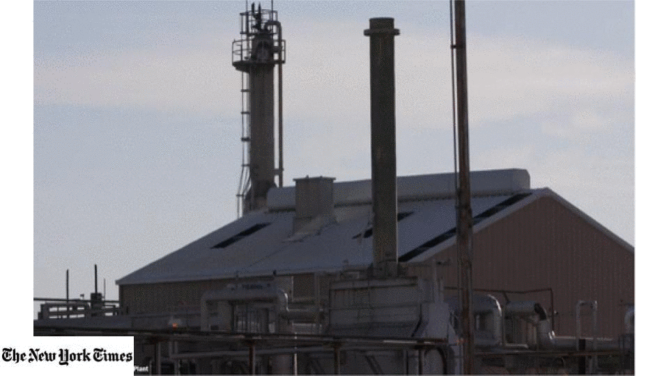

## Methane-detection-from-hyperspectral-imagery
H-MRCNN introduces fast algorithms to analyze large-area hyper-spectral information and methods to autonomously represent and detect CH4 plumes. This repo contains 2 methods for processing different type of data, Single detector works on 4-channels data and Ensemble detectors works on 432-channels raw hyperspectral data recorded from AVIRIS-NG instrument. 
### [**Deep Remote Sensing Methods for Methane Detection in Overhead Hyperspectral Imagery**](https://openaccess.thecvf.com/content_WACV_2020/papers/Kumar_Deep_Remote_Sensing_Methods_for_Methane_Detection_in_Overhead_Hyperspectral_WACV_2020_paper.pdf)
[Satish Kumar*](https://www.linkedin.com/in/satish-kumar-81912540/), [Carlos Torres*](https://torrescarlos.com), [Oytun Ulutan](https://sites.google.com/view/oytun-ulutan), [Alana Ayasse](https://www.linkedin.com/in/alana-ayasse-18370972/), [Dar Roberts](http://geog.ucsb.edu/archive/people/faculty_members/roberts_dar.htm), [B S Manjunath](https://vision.ece.ucsb.edu/people/bs-manjunath).

Official repository of our [**WACV 2020**](https://openaccess.thecvf.com/content_WACV_2020/papers/Kumar_Deep_Remote_Sensing_Methods_for_Methane_Detection_in_Overhead_Hyperspectral_WACV_2020_paper.pdf) paper.



This repository includes:
* Source code of single-detector and ensemble detectors(H-MRCNN) built on Mask-RCNN.
* Training code for single-detector and ensemble detectors(H-MRCNN)
* Pre-trained ms-coco weights of Mask-RCNN
* Annotation generator to read-convert mask annotation into json.
* Modified spectral library of python
* Example of training on your own dataset

-brightgreen/?style=flat&logo=python&color=green)


The whole repo folder structure follows the same style as written in the paper for easy reproducibility and easy to extend. If you use it in your research, please consider citing our paper (bibtex below)

## Citing
If this work is useful to you, please consider citing our paper:
```
@inproceedings{kumar2020deep,
  title={Deep Remote Sensing Methods for Methane Detection in Overhead Hyperspectral Imagery},
  author={Kumar, Satish and Torres, Carlos and Ulutan, Oytun and Ayasse, Alana and Roberts, Dar and Manjunath, BS},
  booktitle={2020 IEEE Winter Conference on Applications of Computer Vision (WACV)},
  pages={1765--1774},
  year={2020},
  organization={IEEE}
}
```

### Requirements
- Linux or macOS with Python ≥ 3.6
- Tensorflow <= 1.8
- CUDA 9.0
- cudNN (compatible to CUDA)

### Installation
1. Clone this repository
2. Install dependencies
```
pip install -r requirements.txt
```
#### Single-detector
Running single-detector is quite simple. Follow the [README.md](https://github.com/satish1901/Methane-detection-from-hyperspectral-imagery/blob/master/single_detector/README.md) in single_detector folder
```
single_detector/README.md
```

#### Ensemble-detector
For Running ensemble-detector we need some pre-processing. Follow the [README.md](https://github.com/satish1901/Methane-detection-from-hyperspectral-imagery/blob/master/ensemble_detectors/README.md) in emsemble_detector folder
```
ensemble_detector/README.md
```

