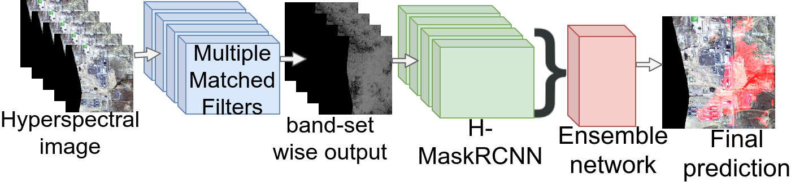

### Ensemble-Detector
Ensemble detector works on raw input data (un-rectified)[Dataset B in paper]. Each datum is 432-channel/bands file. This data is first processed in sets of channels, where each set contains 50-channels/bands. Each set have an overlap of 25-channels/bands with neighbouring sets. Overview of pipeline is shown below :

