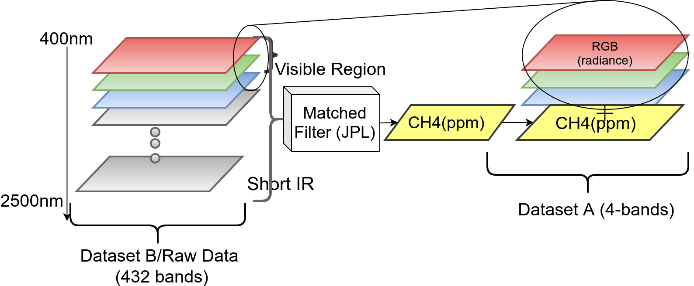

### Single-Detector
It works on data preprocessed by matchedfilter already, this is 4-channel data files
- Channels 0,1,2 corresponds to R,G,B
- Channel 3 corresponds for processed output from matched-filter as shown below


### Getting Started
- If using virtual environment, activate your virtual env
- #### Mask-RCNN setup 
```
cd ./single_detector/src/custom-mask-rcnn-detector/mask_rcnn
python setup.py install
```
- #### Generating training data for our detector
```
cd ./single_detector
```
Run data_generator script, it takes path to "data" directory as input
```
./data_generator.sh '<path to data directory>'
e.g. 
(relative path) ./data_generator.sh '../data' 
or
(absolute path)[preferred]
./data_generator.sh '/home/<username>/Methane-detection-from-hyperspectral-imagery/single_detector/data'
```
- #### Training the detector
you will find your processed training data and annotation file at location 
```
Training Data :  single_detector/src/custom-mask-rcnn-detector/ch4_data/train_data
Annotations   : single_detector/src/custom-mask-rcnn-detector/ch4_data/annotation_plumes.json
```
To train the detector, Run :
```
cd ./single_detector/src/custom-mask-rcnn-detector
python detector.py --mode train
```
The corresponsing trained weight will be stored at :
```
Trained weights : ./single_detector/src/custom-mask-rcnn-detector/logs
```
- #### Testing the detector
```
python detector.py --mode predict -image <path to processed input file to detector>
```
Output is generated in the same directory

### Step by Step Detection
To help with debugging and understanding the model, you can run ([mask_tiling.py](https://github.com/satish1901/Methane-detection-from-hyperspectral-imagery/blob/master/single_detector/annotation_tool/mask_tiling.py), [json_creator.py](https://github.com/satish1901/Methane-detection-from-hyperspectral-imagery/blob/master/single_detector/annotation_tool/json_creator.py), [train_data_generator.py](https://github.com/satish1901/Methane-detection-from-hyperspectral-imagery/blob/master/single_detector/annotation_tool/train_data_generator.py)), that allows running the model step by step to inspect the output at each point. Here are few examples :

#### 1. Model Architecture:

The model architecture shows data flow from left-->right, we have an input image of size ~1500 x 23000 x 4 along with a ground truth file(binary) of size 1500 x 23000 x 1. We tile each image files because of GPU memory constraint

#### - Ground Truth pre-processing 
[mask_tiling.py](https://github.com/satish1901/Methane-detection-from-hyperspectral-imagery/blob/master/single_detector/annotation_tool/mask_tiling.py) : creates tiles size (256 x 256)of the binary mask. Output is saved in the same datafolder. To Run it :
```
python mask_tiling.py ../data
```
[json_creator.py](https://github.com/satish1901/Methane-detection-from-hyperspectral-imagery/blob/master/single_detector/annotation_tool/json_creator.py) : create a json file, considering each tile created in previous step as an individual image, then run DFS(depth first search) along the boundary of each image to create a json of boundary of plumes shapes. It saves the annotation file at "single_detector/src/custom-mask-rcnn-detector/ch4_data/annotation_plumes.json" , To run it
```
python json_creator.py ../data

```
[train_data_generator.py](https://github.com/satish1901/Methane-detection-from-hyperspectral-imagery/blob/master/single_detector/annotation_tool/train_data_generator.py) : This files creates the training data for our detector, it reads the ~1500 x 23000 x 4 (.envi format) file, process channels 0,1,2 & 3 as show in the image above --> then creates tiles of size (256 x 256 x 3) and saves them as .npy files to be used by detector. It saves the training data at location "single_detector/src/custom-mask-rcnn-detector/ch4_data/train_data". To run it
```
python train_data_generator.py ../data
```
